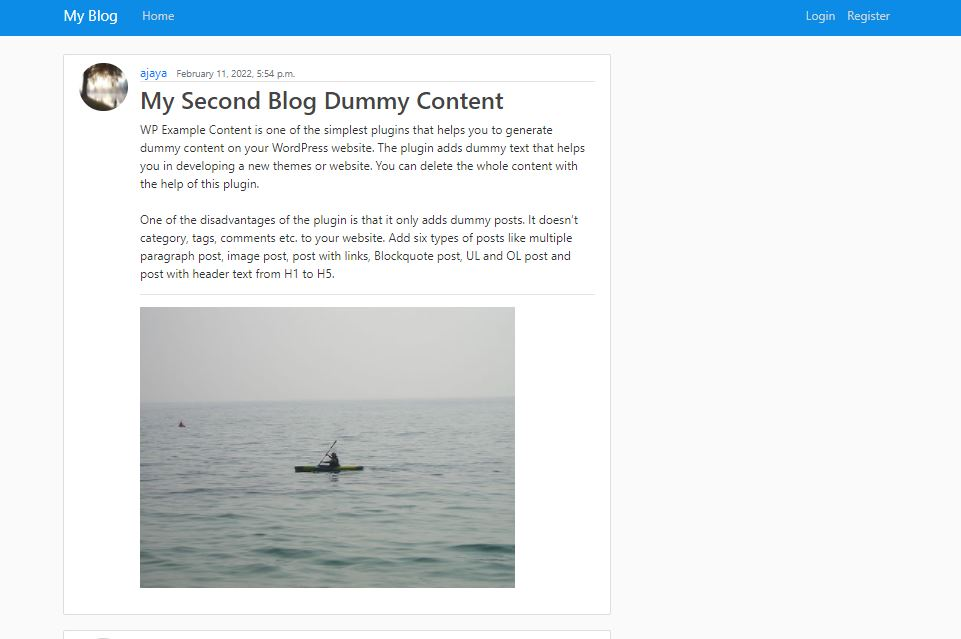
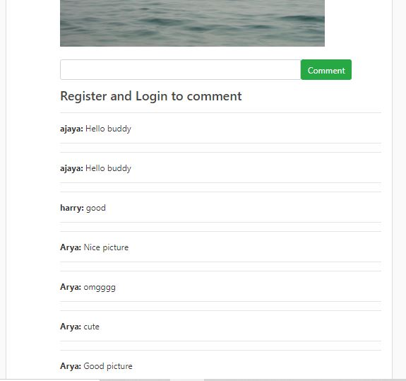

<h3>Blog Application</h3>

<h2>Introduction</h2>
 Django based web application where user can see others post, create, update and delete their post, profile and can comment on the post. At first the user must register and login into the system to be able to create and comment on the post. Without registration and login user can only view others post in the application. Used Class Based Views, Function Based Views, Django Signals and Ajax concept while building the project. 

<h2>Features</h2>
 * After login user can add picture along with title and description. 
 * User can comment in their own post as well as others. (Using AJAX) 
 * User can only able to delete and update their post. 
 * Each user has their profile where they can add their profile picture and add extra information  

<h1>Output of the project</h1>

<h3>Before Login</h3>
     

<h3>After Login</h3>
     

